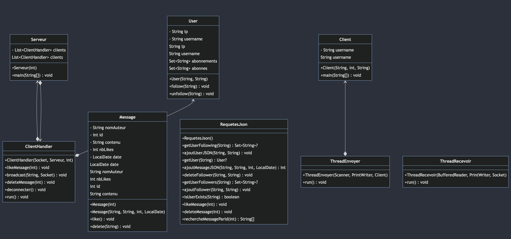

# Tuit'o :incoming_envelope:


## 📝 Table des matières


<nav>
    <ul>
        <li><a href="#description">Description du projet</a></li>
        <li><a href="#membres">Membres du groupe</a></li>
        <li><a href="#fonctionnalites">Les fonctionnalités</a></li>
        <li><a href="#technologies">Les technologies utilisées</a></li>
        <li><a href="#installation">Installation</a></li>
        <li><a href="#utilisation">Utilisation</a></li>
        <li><a href="#documentation">Manuel Utilisateur</a></li>
        <li><a href="#justification">Justification des choix techniques</a></li>
        <li><a href="#diagramme">Diagramme de classe</a></li>
    </ul>
</nav>

## :page_facing_up: Description du projet <a name = "description"></a>

Ce projet est un projet de groupe réalisé dans le cadre de notre deuxième année de BUT Informatique. Il a pour but de nous faire découvrir le monde de l'entreprise et de nous faire travailler en groupe sur un projet concret. Ce projet porte plus précisément sur la création d'une application client-serveur recréant un réseau social qui s'appelera `Tuit'o`.

Pour la bonne compréhension du projet, il est primordial de lire ce rapport avant de lire le code. Il donne des indicationqs sur les choix techniques que nous avons fait et sur les fonctionnalités que nous avons implémentées mais également sur la façon dont le projet doit être lancé. 

## :busts_in_silhouette: Membres du groupe <a name = "membres"></a>

[](https://github.com/Yannis-barache)


[](https://github.com/ibarry25)

## :computer: Les technologies utilisées <a name = "technologies"></a>
- `Java` (pour le serveur et le client)
- `Git` (pour la gestion du projet)

## :inbox_tray: Installation <a name = "installation"></a>

Pour installer le projet, il vous suffit de cloner le projet sur votre machine.

```bash
git clone https://github.com/Yannis-barache/SAE_Reseau_Systeme.git
```

##  Utilisation <a name = "utilisation"></a>

Pour utiliser l'application, il vous suffit d'executer le fichier `compil.sh` qui se trouve à la racine du projet avec la commande suivante.

```bash
./compil.sh
```

ensuite il vous suffit d'exécuter le fichier Serveur.java puis le fichier Client.java dans un autre terminal (on précise qu'il faut exécuter directement avec le bouton run de vscode car sinon vous aurez des erreurs de json).

## Manuel utilisateur <a name = "documentation"></a>


### Pour poster un message

`<message>` : Permet de poster le message que l'utilisateur souhaite ce message sera mis dans le json 
et pourra être liké ou supprimé par la suite.

### Pour interagir avec l'application 

L'utilisateur peut utiliser le terminal pour interagir avec l'application. Il peut utiliser 
les commandes suivantes précédés par un `/` :


#### Pour supprimer un message

`delete <id_message>` : Permet de supprimer un message en indiquant le message 
que l'utilisateur souhaite supprimer.

#### Pour liker un message
`like <id_message>` : Permet de liker un tuit en indiquant l'id du message que l'utilisateur souhaite liker.

#### Pour suivre ou ne plus suivre un utilisateur
`follow <nom_utilisateur>` : Permet de suivre l'utilisateur passée en paramètre. <br>
`unfollow <nom_utilisateur>` : Permet de ne plus suivre l'utilisateur passée en paramètre.

Il ne faut pas mettre d'espace entre les commandes et les messages dans le terminal sinon des bugs seront constatés.


## Justification des choix techniques <a name = "justification"></a>

### Pourquoi Java ?

Nous avons choisi Java car c'est un langage que nous connaissons bien et qui est très utilisé dans le monde de 
l'entreprise. De plus, il est très utilisé pour la création d'application client-serveur.
Dans l'optique de réaliser une interface graphique, nous aurions aussi pu utiliser JavaFX.

### Pourquoi utiliser un json ?
Toutes les données de l'application sont stockées dans un fichier json.
Le json est un format de fichier très utilisé donc très documenté. 
Il est aussi très facile à manipuler en Java avec l'utilisation de 
`org.json` qui est une librairie très connue et très utilisée.

Une autre solution aurait été d'utiliser une base de données mais nous avons préféré utiliser un fichier json car 
nous n'avions pas besoin de faire des requêtes complexes et nous n'avions pas besoin de faire des jointures.


### Qu'est-ce qu'on a pas pu faire ?

Nous n'avons pas pu géré, par manque de temps le fait qu'on ne puisse pas liker plusieurs fois un message.
Aussi l'interface graphique est une partie que nous n'avons pas pu faire car aussi par manque de temps car nous voulions nous assurer que toutes les fonctionnalités disponibles dans le terminal fonctionnent correctement.

### Qu'est-ce qu'on a pu faire ?  

Toutes les fonctionnalités ont été implémantées et fonctionnent correctement. Nous avons aussi pu faire en sorte que le serveur puisse gérer plusieurs clients en même temps. Un client lorsqu'il envoie un message quelconque ne peut l'envoyer qu'à une personne à laquelle il est abonné. Il ne peut pas envoyer de message à une personne à laquelle il n'est pas abonné et donc cette personne ne pourra pas voir le message, autre condition, il faut que l'autre personne soit abonnée en retour. De plus un client peut certes liker un message en revanche il peut le liker autant de fois qu'il le souhaite ce qui ne fait pas de sens. Le serveur peut également supprimer les messages et l'utilisateur avec tous les messages qu'il a envoyé. Le serveur peut également supprimer un message mais aussi supprimer un utilisateur et tous ses messages.
Pour voir que les résultats sont effectifs, il faut regarder dans le json pour voir si les actions ont bien été effectuées. 

### Qu'est-ce qu'on en retiens ?

Nous avons beaucoup appris durant cette SAÉ notamment à mettre en oeuvre les compétences " Administrer des systèmes informatiques communicants complexes" et "Travailler dans une équipe informatique" cela car il fallait très bien gérer la connexion entre le serveur et le client et aussi car il fallait bien se répartir les tâches pour que chacun puisse travailler sur une partie du projet. Nous avons aussi renfotcer notre utilisation des outils de gestion de projet comme `git` et `github` qui sont très utilisés dans le monde de l'entreprise et qui sont très utiles pour travailler en groupe.

Nous sommes tout de même assez déçu car nous aurions aimé en faire beaucoup plus notamment au niveau de l'interface graphique et aussi au niveau de la gestion des erreurs mais le temps nous a manqué en raison.  

## Diagramme de classe  <a name = "diagramme"></a>
<div style="text-align:center">

</div>


